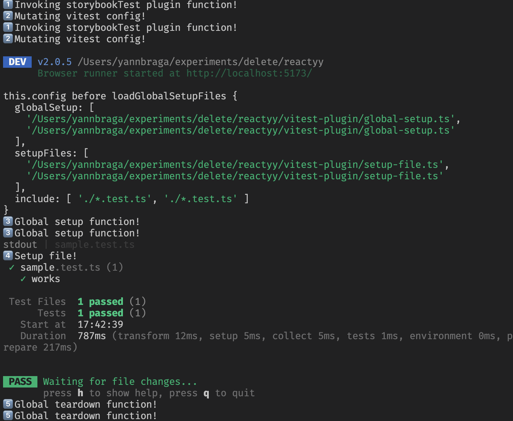
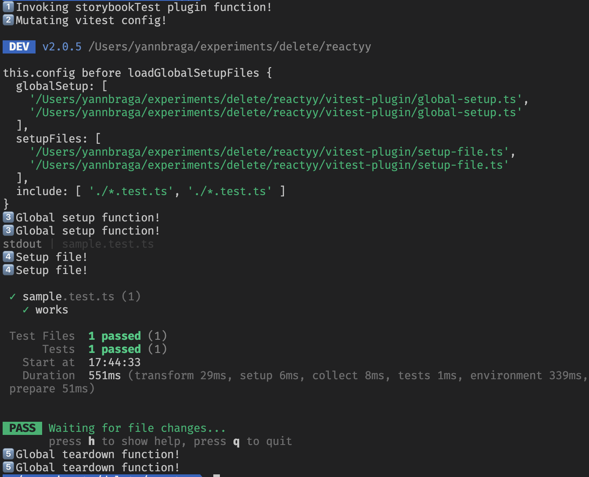
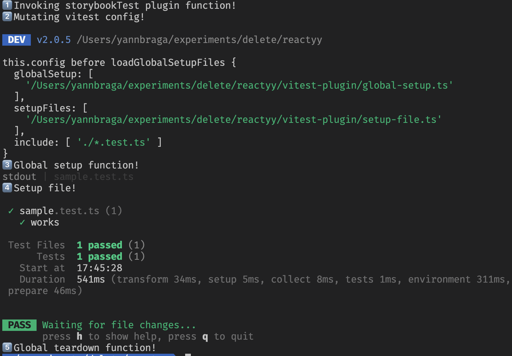

## Repro

1 - run `yarn install`
2 - run `yarn test`
3 - Check the code at [./vitest-plugin](./vitest-plugin/storybook-plugin.ts)

### With browser mode enabled:

### With browser mode disabled:

### When changing to use `configResolved` instead of `config`:
